# AI Repository Strategy

> Separation boundary between AI-assisted development artifacts and production code.
> Owner: All Teams

---

## Quick Classification

```mermaid
flowchart LR
    subgraph V["✅ VERSIONED in Git"]
        A["AGENTS.md<br/>Project agent brief"]
        C["AI.md<br/>AI session config"]
        D["docs/ai/*<br/>AI policies"]
        S["docs/security/*<br/>Security policies"]
    end

    subgraph L["❌ LOCAL-ONLY (gitignored)"]
        O[".opencode/<br/>Runtime: 5,894 files"]
        X[".codex/<br/>Runtime: 5,506 files"]
        AG["agency-agents/<br/>External: 239 files"]
        GR["graphify-out/<br/>Generated: 383 files"]
        QW[".qwen/"]
        WT[".witsy/"]
        SK["skills-lock.json"]
        MC[".mcp.json"]
        BS["_build_agency_skills.ps1"]
    end

    V -->|can reference| L
```

| Asset | Status | Size | Regenerable? | Rationale |
|-------|--------|------|-------------|-----------|
| `AGENTS.md` | ✅ VERSIONED | 1 file | No | Hand-authored agent entry point |
| `AI.md` | ✅ VERSIONED | 1 file | No | Hand-authored AI session config |
| `.opencode/` | ❌ LOCAL-ONLY | 5,894 files | Yes | Full runtime: agents, skills, node_modules, memory |
| `.codex/` | ❌ LOCAL-ONLY | 5,506 files | Yes | Full runtime: agents, skills, node_modules, memory |
| `agency-agents/` | ❌ LOCAL-ONLY | 239 files | Yes | External repo clone (`ruv.net/agency-agents`) |
| `graphify-out/` | ❌ LOCAL-ONLY | 383 files | Yes | Auto-generated knowledge graph + cache |
| `.qwen/` | ❌ LOCAL-ONLY | 0 files | Yes | Qwen AI empty state dir |
| `.witsy/` | ❌ LOCAL-ONLY | 0 files | Yes | Witsy AI empty state dir |
| `skills-lock.json` | ❌ LOCAL-ONLY | 1 file | Yes | Auto-generated AI tooling lock |
| `.mcp.json` | ❌ LOCAL-ONLY | 1 file | Yes | Local MCP server configuration |
| `_build_agency_skills.ps1` | ❌ LOCAL-ONLY | 1 file | — | Build script (canonical at `scripts/`) |

---

## Read Next

- [**AI Repository Policy**](./AI_REPOSITORY_POLICY.md) — Full policy with versioning rules, naming conventions, and automation
- [**Repository Hygiene Policy**](../repository/REPOSITORY_POLICY.md) — What else stays local
- [**Environment Policy**](../security/ENVIRONMENT_POLICY.md) — Secrets and env var management
